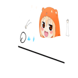
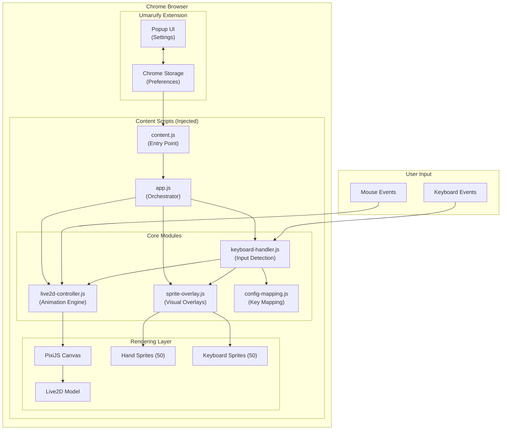
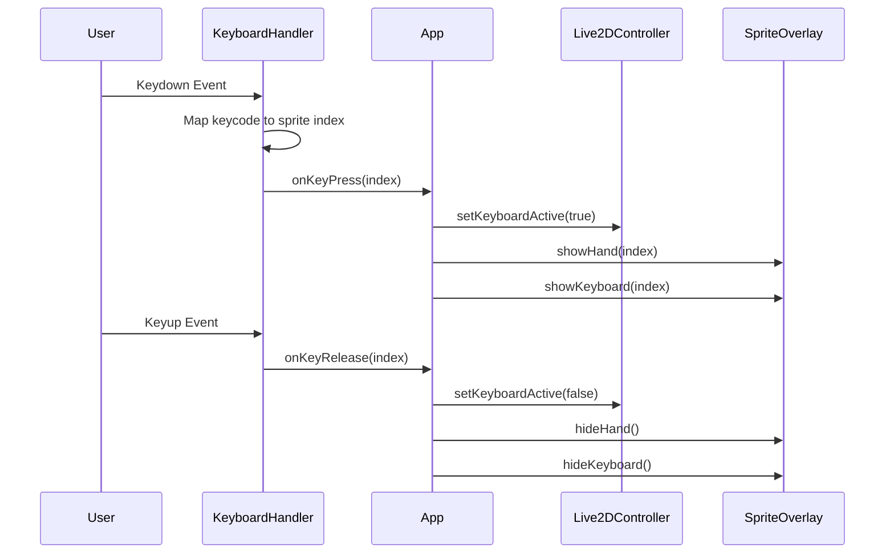

<p align="center">
  
</p>

<h1 align="center">Umaruify</h1>

<p align="center">
  <strong>An interactive anime companion for your browser</strong>
</p>

<p align="center">
  <a href="https://github.com/LakshmanTurlapati/Umaruify/stargazers"></a>
  <a href="https://github.com/LakshmanTurlapati/Umaruify/network/members"></a>
  <a href="https://github.com/LakshmanTurlapati/Umaruify/issues"></a>
  <a href="https://github.com/LakshmanTurlapati/Umaruify/blob/main/LICENSE"></a>
</p>

<p align="center">
  
  
  
  
</p>

---

## About

Umaruify brings an adorable interactive anime companion to your web browsing experience. Inspired by Bongo Cat, this Chrome extension features a Live2D animated character that reacts to your keyboard input and follows your mouse cursor in real-time.

## Features

- **Live2D Animation** - Smooth, high-quality character animation powered by Live2D Cubism 4
- **Keyboard Reactions** - Character responds to 50+ keyboard keys with hand gestures and keyboard highlights
- **Mouse Tracking** - Eyes follow your cursor across the screen
- **Seamless Integration** - Works on any website without interfering with page content
- **Lightweight** - Minimal performance impact with optimized rendering
- **Easy Toggle** - Enable/disable with a single click from the popup

## Demo

<p align="center">
  <a href="https://www.youtube.com/watch?v=WtwWP2oQzw0">
    
  </a>
</p>

<p align="center">
  <em>Click the image above to watch the demo video</em>
</p>

## Screenshots

<p align="center">
  
  &nbsp;&nbsp;
  
</p>

## Architecture



### Component Overview

| Component | Responsibility |
|-----------|---------------|
| `content.js` | Creates overlay container and injects all elements into the page |
| `app.js` | Main orchestrator that initializes modules and coordinates events |
| `keyboard-handler.js` | Captures keyboard events and maps keys to sprite indices |
| `live2d-controller.js` | Manages Live2D model rendering with PixiJS and mouse tracking |
| `sprite-overlay.js` | Handles hand and keyboard sprite visibility |
| `config-mapping.js` | Maps 50 keycodes to corresponding sprite indices |

### Data Flow



## Installation

### From Source (Developer Mode)

1. Clone the repository:
   ```bash
   git clone https://github.com/LakshmanTurlapati/Umaruify.git
   ```

2. Open Chrome and navigate to `chrome://extensions/`

3. Enable **Developer mode** (toggle in top-right corner)

4. Click **Load unpacked** and select the `umaruify-extension` folder

5. The extension icon should appear in your toolbar

### Usage

1. Click the Umaruify icon in your Chrome toolbar
2. Toggle the extension on/off using the checkbox
3. Visit any website and start typing to see the character react

## Project Structure

```
umaruify-extension/
├── manifest.json          # Extension configuration (Manifest V3)
├── content/
│   ├── content.js         # Page injection entry point
│   └── content.css        # Overlay container styles
├── js/
│   ├── app.js             # Main application coordinator
│   ├── keyboard-handler.js
│   ├── live2d-controller.js
│   ├── sprite-overlay.js
│   └── config-mapping.js
├── popup/
│   ├── popup.html
│   ├── popup.js
│   └── popup.css
├── lib/                   # Third-party libraries (PixiJS, Live2D)
├── models/                # Live2D model assets
├── assets/                # Hand and keyboard sprites
└── icons/                 # Extension icons
```

## Tech Stack

- **Chrome Extension Manifest V3** - Modern extension architecture
- **Live2D Cubism 4** - High-quality 2D animation
- **PixiJS** - Fast 2D WebGL renderer
- **Vanilla JavaScript** - No framework dependencies

## Contributing

Contributions are welcome! Here's how you can help:

1. **Fork** the repository
2. **Create** a feature branch (`git checkout -b feature/amazing-feature`)
3. **Commit** your changes (`git commit -m 'Add amazing feature'`)
4. **Push** to the branch (`git push origin feature/amazing-feature`)
5. **Open** a Pull Request

### Ideas for Contributions

- Add more character expressions and animations
- Support for additional browsers (Firefox, Edge)
- Customizable keyboard mappings
- Sound effects option
- Multiple character skins
- Performance optimizations

## Acknowledgments

- Live2D Inc. for the Cubism SDK
- PixiJS team for the rendering engine
- The Bongo Cat meme for inspiration

---

<p align="center">
  
</p>

<p align="center">
  <strong>Made by <a href="https://www.parzival.live">Lakshman Turlapati</a></strong>
</p>

<p align="center">
  <a href="https://staging.d364wjsbiwvjpv.amplifyapp.com">
    
  </a>
  <a href="https://www.parzival.live">
    
  </a>
  <a href="https://github.com/LakshmanTurlapati">
    
  </a>
</p>
